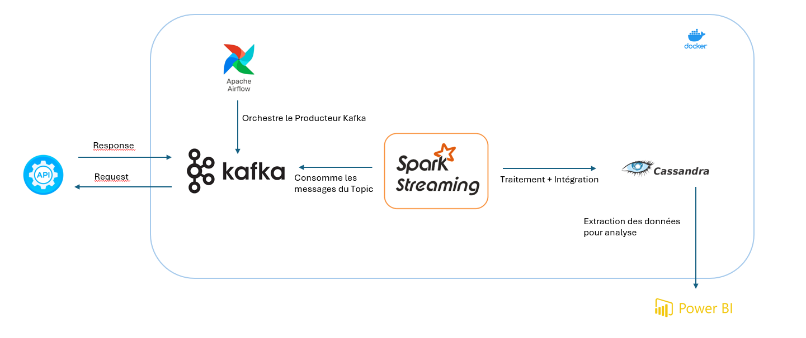
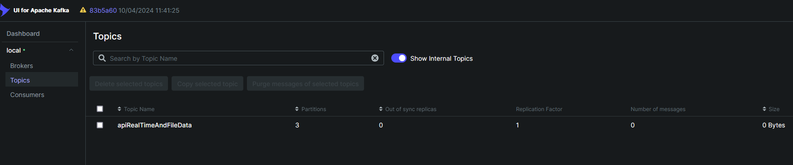
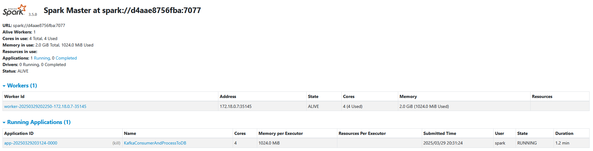
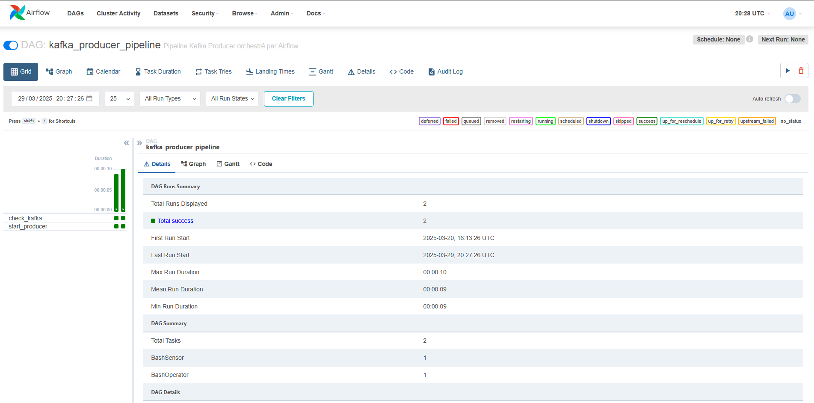
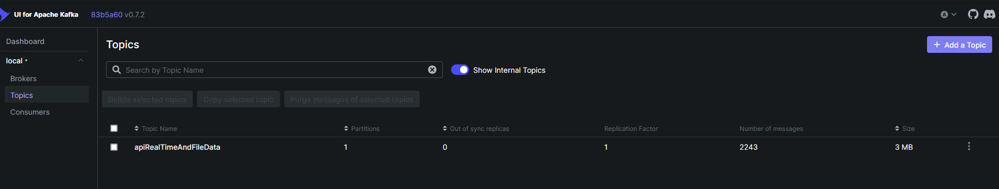
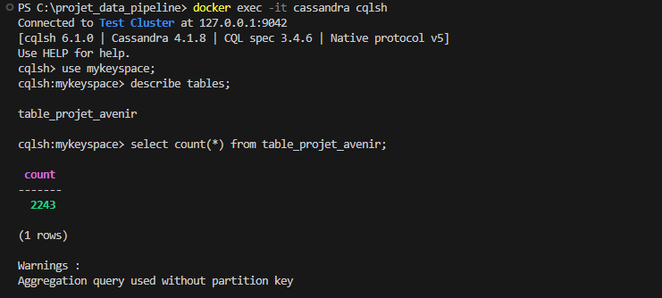

# Data Pipeline ADEME 🚀 Kafka, Spark, Airflow, Redis et Power BI  


📋 Vue d'ensemble
Ce projet implémente une architecture complète de traitement de données en temps réel pour analyser le programme investissements d'avenir du plan "France Relance". La solution capture les données depuis une API publique de l'ADEME (Portail Open Data), les traite via un pipeline distribué, et les rend disponibles pour des analyses avancées et des visualisations.  

🔑 Points forts  
*  Pipeline de données complet : Ingestion, traitement, stockage et analyse
*  Architecture événementielle avec **Apache Kafka**
*  Traitement en temps réel avec **Spark Structured Streaming** & **PySpark**
*  Persistence NoSQL avec **Cassandra**
*  Orchestration de workflows avec **Apache Airflow**
*  Conteneurisation complète avec **Docker** & **Docker Compose**
*  Mise en cache avec **Redis**
*  Analyse et visualisation et Insights avec **Power BI**

# 🏗️ Architecture technique  



---

## 📋 Table des Matières

1. [Aperçu du Projet](#-aperçu-du-projet)
2. [Technologies Utilisées](#-technologies-utilisées)
3. [Structure du Projet](#-structure-du-projet)
4. [Installation et Déploiement](#-installation-et-déploiement)
5. [Flux de Données](#-flux-de-données)
6. [Analyse et insights](#-visualisation-avec-power-bi)

---

## 🚀 Aperçu du Projet

Ce projet vise à démontrer la capacité à gérer des flux de données complexes en temps réel. Il comprend :

- **Ingestion de données** : Récupération de données à partir de l'API publique de l'ADEME et envoi vers Kafka.
- **Traitement de données** : Transformation et traitement des données avec Apache Spark.
- **Stockage** : Stockage des données traitées dans Cassandra.
- **Orchestration** : Automatisation des tâches avec Apache Airflow.
- **Visualisation** : Création de tableaux de bord interactifs avec Power BI.

---

## 🛠 Technologies Utilisées

- **Apache Kafka** : Pour le streaming de données en temps réel.
- **Apache Spark** : Pour le traitement et la transformation des données.
- **Apache Airflow** : Pour l'orchestration des tâches du pipeline.
- **Cassandra** : Pour le stockage des données traitées.
- **Redis** : Pour la gestion de l'état et la mise en cache.
- **Docker** : Pour la conteneurisation et le déploiement.
- **Power BI** : Pour la visualisation des données.

---

## 📂 Structure du Projet

Voici la structure du projet :

projet_data_pipeline/  
├── dags/ # DAGs Airflow  
├── dockerfiles/ # Contient les Dockerfile pour Airflow et Spark + le fichier yaml pour Cassandra  
├── images # images et captures du projet  
├── jars # Contient les jars pour Spark, et pour lancer le traitement  
├── scripts/ # Scripts Python (/bashfiles pour lancer le consommateur et la création du topic + producteur Kafka, consommateur Spark)   
├── docker-compose.yml # Configuration Docker pour l'infrastructure  
├── README.md  
└── requirements # Installation pour Python et les autres composants  

---

## 🛠 Installation et Déploiement

### Prérequis

- Docker et Docker Compose installés.
- Git
- Power BI Desktop (pour la visualisation).

### Étapes de Déploiement

1. **Cloner le Dépôt** :
   ```bash
   git clone https://github.com/votrenomutilisateur/projet_data_pipeline.git
   cd projet_data_pipeline
   ```
2. **Démarrer les conteneurs Docker**:
    ```bash
    docker-compose up -d
    ```
3. **Créer les Topics Kafka**
    ```bash
    ./scripts/bashfiles/create_topics.sh
    ```   

    * On vérifie que le topic est crée dans Kafka UI:  

      

4. **Démarrer le consommateur avec Spark**
    ```bash
    ./scripts/bashfiles/start_consumer_on_data.sh  
    ```  

    * Les messages du Topic sont consommées via le consommateur Kafka lancé par Spark. On a bien l'application suivante:  

        

5. **Executer le DAG Airflow**

    * Accédez à l'interface Airflow à l'adresse http://localhost:8082.   

     

    * Déclenchez le DAG kafka_producer_pipeline.  

    * Verfier que le Topic contient bien les messages envoyés par le Producteur Kafka:  

      

    * Verifier dans Cassandra l'insertion des données:  

    

6. **Extraire les données de Cassandra**
    ```bash
    python3 extract_data_from_db.py
    ```
7. **Visualiser les données dans Power BI**

    * Importez le fichier cassandra_data.csv dans Power BI.

    * Créez des tableaux de bord interactifs.

## 🔄 Flux de Données

* Ingestion : Les données sont récupérées sur l'API ADEME grâce à un Producer Kafka, et orchestré avec Airflow.

* Traitement : Normalisation, transformation et enrichissement des données

* Stockage : Persistance dans Cassandra pour les requêtes et analyses

* Analyse : Exploitation des données avec requêtes CQL et Power BI

* Visualisation : Tableaux de bord interactifs et rapports analytiques


## 📊 Analyse et insights

* Ce pipeline permet d'analyser en profondeur les investissements d'avenir de l'État français à travers plusieurs dimensions:

    * Répartition géographique des financements (régions, départements)

    * Distribution par secteurs d'activité et types de projets

    * Évolution temporelle des investissements
    
    * Indicateurs de performance des projets

    * Impact économique par territoire


